# Clinical Co-Pilot — System Architecture

**AgentForge · Gauntlet AI**

This diagram shows the full system architecture for the Clinical Co-Pilot, including the browser client, cloud infrastructure (OpenEMR + Agent microservice), external LLM, and test infrastructure. Reflects PRD v1.1: 8 tools (vitals split from labs), POST /flag endpoint, session scoping, and agent-unreachable fallback state.

```mermaid
flowchart TB
    classDef browser  fill:#DBEAFE,stroke:#2563EB,color:#1E3A5F
    classDef openemr  fill:#DCFCE7,stroke:#16A34A,color:#14532D
    classDef agent    fill:#EDE9FE,stroke:#7C3AED,color:#3B0764
    classDef verify   fill:#FEE2E2,stroke:#DC2626,color:#7F1D1D
    classDef external fill:#FEF3C7,stroke:#D97706,color:#78350F
    classDef db       fill:#F1F5F9,stroke:#64748B,color:#1E293B
    classDef obs      fill:#CCFBF1,stroke:#0D9488,color:#134E4A
    classDef test     fill:#FFE4E6,stroke:#BE123C,color:#881337
    classDef infra    fill:#F8FAFC,stroke:#94A3B8,color:#334155

    subgraph BROWSER["🖥️  Physician Browser"]
        OPAGE["OpenEMR Chart Page"]
        CHATJS["Chat Panel\nchat.js · stream.js · ui.js"]
        OPAGE --> CHATJS
    end

    subgraph CLOUD["☁️  Docker Compose — Railway / Fly.io"]

        NGX["⚙️ Nginx\nReverse Proxy · SSL Termination"]

        subgraph OPENEMR_C["📋  OpenEMR — PHP / Apache"]
            PHP_APP["PHP Application\nChart · Auth · Modules"]
            COPILOT["copilot_panel.php\nconfig.php"]
            FHIR_EP["FHIR R4 API\n/apis/default/fhir/"]
            REST_EP["REST API\n/api/appointment · /api/user"]
        end

        subgraph DB_C["🗄️  MySQL"]
            DB[("Patient Database\nPHI · EHR Records")]
        end

        subgraph AGENT_C["🤖  Agent Microservice — FastAPI · Python 3.11"]

            subgraph API_L["API Layer"]
                ROUTES["POST /chat · POST /summary\nPOST /flag\nGET /chat/stream SSE"]
                AUTH_MW["Auth Middleware\nToken Validation · Role Injection"]
                LOG_MW["PHI-Safe Logger\nSHA-256 Hashed IDs · JSON"]
            end

            AGENT_STATE["AgentState\npatient_id · user_role · session_id\nmessages · tool_results · verified"]

            subgraph GRAPH_L["LangGraph State Machine"]
                RETRIEVE_N["Retrieve Node\nTool Dispatch"]
                GENERATE_N["Generate Node\nPrompt Assembly · LLM Call"]
                VERIFY_N["Verify Node\nGrounding + Domain Rules"]
            end

            subgraph VERIF_L["Verification Layer"]
                GROUND["grounding.py\nSource Attribution Check"]
                DOMAIN["domain_rules.py\nAllergy · Lab Range · Date Logic"]
            end

            subgraph TOOLS_L["Patient Context Tools  (8 total)"]
                FHIR_TOOLS["FHIR Tools ×7\ndemographics · medications\nlabs · vitals · allergies\nproblem_list · visit_notes"]
                REST_TOOLS["schedule.py\nREST Tool"]
            end

            subgraph EHR_L["EHR Data Clients"]
                FHIR_CL["fhir_client.py\nAsync FHIR R4 Client"]
                REST_CL["openemr_client.py\nREST API Client"]
            end

            RBAC["rbac.py\nPHYSICIAN · NURSE · ADMIN\nPermission Matrix"]
        end

        subgraph LFUSE["📊  Langfuse — Self-Hosted"]
            LF["Observability Dashboard\nTraces · Spans · Token Costs · Latency"]
        end

    end

    subgraph EXT["🌐  External Services"]
        CLAUDE["Anthropic API\nClaude Sonnet\nToken Streaming"]
    end

    subgraph TESTS["🧪  Test Infrastructure"]
        UNIT_T["Unit Tests\nagent/tests/unit/  ·  9 files\nNo live services required"]
        INTG_T["Integration Tests\nagent/tests/integration/  ·  4 files\nRequires running OpenEMR"]
        EVAL_T["Eval Suite\nagent/eval/  ·  20+ cases\nHappy path · Missing data\nAuth boundary · Adversarial"]
    end

    %% ── Browser ↔ Nginx ──────────────────────────────────────────────────
    CHATJS -->|"HTTPS  ·  SSE"| NGX
    NGX    -->|"SSE token stream"| CHATJS

    %% ── Nginx routing ────────────────────────────────────────────────────
    NGX -->|"/ → OpenEMR :80"| PHP_APP
    NGX -->|"/agent → FastAPI :8000"| ROUTES
    PHP_APP --> COPILOT
    COPILOT -.->|"injects widget into chart"| CHATJS

    %% ── OpenEMR internals ────────────────────────────────────────────────
    PHP_APP --> FHIR_EP & REST_EP
    FHIR_EP & REST_EP --> DB

    %% ── Auth: agent validates OpenEMR session token ───────────────────────
    AUTH_MW -->|"GET /api/user — validate session"| REST_EP

    %% ── API layer flow ───────────────────────────────────────────────────
    ROUTES --> AUTH_MW & LOG_MW
    ROUTES --> AGENT_STATE
    AGENT_STATE --> RETRIEVE_N

    %% ── LangGraph node flow ───────────────────────────────────────────────
    RETRIEVE_N --> GENERATE_N --> VERIFY_N
    VERIFY_N   -->|"verified: false  ·  retry ≤ 1"| GENERATE_N
    VERIFY_N   -->|"verified: true"| ROUTES

    %% ── RBAC ─────────────────────────────────────────────────────────────
    RETRIEVE_N -->|"enforce(role, tool)"| RBAC

    %% ── Tools → EHR clients → OpenEMR APIs ──────────────────────────────
    RETRIEVE_N  --> FHIR_TOOLS & REST_TOOLS
    FHIR_TOOLS  --> FHIR_CL
    REST_TOOLS  --> REST_CL
    FHIR_CL     -->|"FHIR R4 queries"| FHIR_EP
    REST_CL     -->|"REST calls"| REST_EP

    %% ── LLM call ─────────────────────────────────────────────────────────
    GENERATE_N -->|"prompt + tool_results"| CLAUDE
    CLAUDE     -->|"token stream"| GENERATE_N

    %% ── Verification internals ───────────────────────────────────────────
    VERIFY_N --> GROUND & DOMAIN

    %% ── Observability ────────────────────────────────────────────────────
    RETRIEVE_N & GENERATE_N & VERIFY_N -->|"spans"| LF
    LOG_MW -->|"request logs"| LF
    ROUTES -->|"FLAG events  ·  turn_index · reason"| LF

    %% ── Test targets ─────────────────────────────────────────────────────
    UNIT_T -.->|"mocks + asserts"| AGENT_C
    INTG_T -.->|"live calls"| AGENT_C
    INTG_T -.->|"live calls"| OPENEMR_C
    EVAL_T -.->|"end-to-end"| AGENT_C

    %% ── Class assignments ────────────────────────────────────────────────
    class OPAGE,CHATJS browser
    class PHP_APP,COPILOT,FHIR_EP,REST_EP openemr
    class ROUTES,AUTH_MW,LOG_MW,AGENT_STATE,RETRIEVE_N,GENERATE_N,FHIR_TOOLS,REST_TOOLS,FHIR_CL,REST_CL,RBAC agent
    class GROUND,DOMAIN,VERIFY_N verify
    class CLAUDE external
    class DB db
    class LF obs
    class UNIT_T,INTG_T,EVAL_T test
    class NGX infra
```

---

## Key Architecture Decisions

| Decision | Choice | Rationale |
|----------|--------|-----------|
| Agent placement | Separate FastAPI microservice in same Docker network | Keeps Python/AI code cleanly separated from OpenEMR PHP; communicates via FHIR/REST API |
| Data access | FHIR R4 as primary, direct MySQL as fallback | FHIR is the standard; some resources (e.g. appointments) require REST fallback |
| Auth flow | OpenEMR session token passed to agent via Authorization header | No second auth system; agent validates token against OpenEMR's own `/api/user` endpoint |
| LLM | Claude Sonnet (Anthropic) | Large context window, reliable JSON output, best instruction following for clinical structured output |
| Agent framework | LangGraph | Explicit state management for multi-turn sessions; retrieve → generate → verify loop with retry |
| Verification | Programmatic grounding check + domain rules | Faster than LLM-as-judge; deterministic; catches hallucinations and clinical constraint violations |
| Observability | Langfuse (self-hosted) | HIPAA-compatible; full trace visibility across all LangGraph nodes |
| Frontend | Vanilla JS + SSE injected into OpenEMR PHP | Minimal integration surface; avoids CORS complexity of a separate SPA |
| Vitals / labs split | Two separate FHIR tools on the same Observation resource (category filter) | NURSE can access vitals without accessing labs; RBAC permission boundary requires distinct tool identities |
| Session scoping | `AgentState` is bound to one `patient_id`; navigation change resets state | Prevents context bleed between patients; aligns with clinical workflow of one chart at a time |
| Incorrect response flagging | `POST /flag` writes a `FLAG` event to Langfuse; no re-generation | Audit trail for clinical safety; out-of-scope to auto-correct responses in v1 |
| Graceful degradation | Frontend renders static "Co-Pilot unavailable" banner when agent service is unreachable | Clinicians can still use OpenEMR normally; agent failure must not block core EHR workflows |
